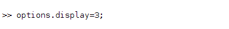
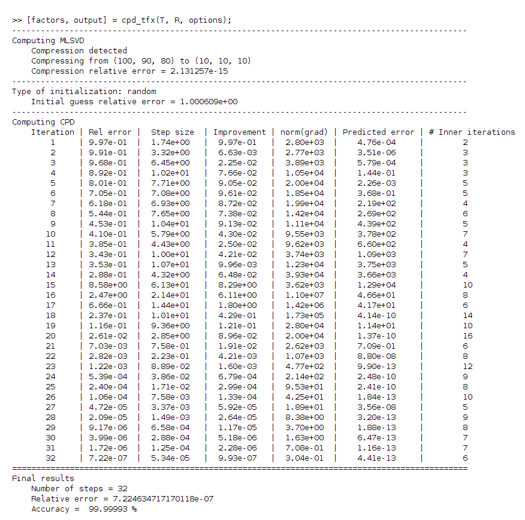
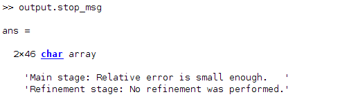
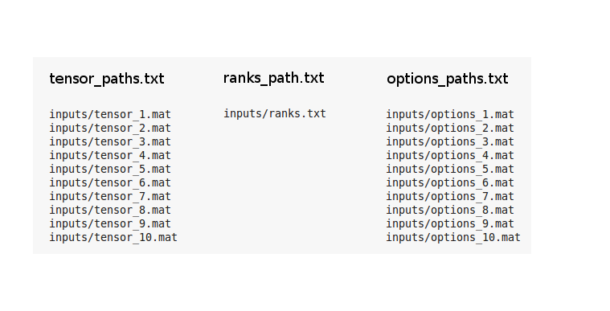
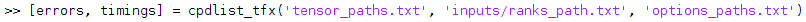

# Tensor Fox for Matlab

Tensor Fox is written in Python and I highly recommend you to use the Python version. That being said, you can use a 
limited version of Tensor Fox for Matlab, where instead of being a tensor package with several useful routines, basically
you have just a CPD solver. This version was tested and is stable with Matlab 2017a - Linux Mint 17.2 Cinnamon 64-bit. 

## Table of Contents
* [ :fox_face: Installation](#installation)
* [ :fox_face: Getting Started](#started)
* [ :fox_face: Future Works](#future)
* [ :fox_face: Author](#author)
* [ :fox_face: License](#license)
* [ :fox_face: References](#references)

## :fox_face: Installation

Since Tensor Fox package is written in Python, it is necessary to call Python within Matlab. For this you need to have 
Python installed. The following modules also are necessary:

    numpy
    scipy
    sklearn
    numba
    h5py

If everything is ok you will be able to open Python within Matlab with the exclamation (!) command.

To exit Python type *exit()*, then you go back to the Matlab session. Make sure Numba and Numpy are updated. Additionaly, 
make sure you are using a nice version of BLAS (MKL if possible). Instead of installing all these modules manually, other 
possibility is to install [Anaconda](https://www.anaconda.com/distribution/), then everything, including the BLAS 
version, will be installed properly and up to date. This is the preferred way. 

We remark that having the correct BLAS is very important, the performance can drop by orders of magnitude if this is not 
setup correctly. To check if your Python-Numpy is linked against the correct BLAS, in your Matlab session type *!python* 
to start a Python session, then do as showed below.

Note that MKL is mentioned at each informational block. MKL is the best choice currently.

Once you have Python with all its dependencies working properly in a Matlab session, you are read. At the moment only the 
CPD function is provided, but Tensor Fox is more than that. To enjoy all of its functionalities it is necessary to use 
Python instead Matlab. All *.py* files of this package are located in the folder *tensorfox*. For more information about 
this package check the original source: https://github.com/felipebottega/Tensor-Fox

## :fox_face: Getting Started

There are two new functions provided by this package: **cpd_tfx** and **cpdlist_tfx**. The first one works in the usual 
way, i.e., the user can pass the tensor, rank and options as arguments, then the function computes the approximated CPD. 
We start creating an example 100 x 90 x 80 tensor with rank **R** = 10.

The struct **options** contains all the parameter setup for the solver. In this case we let the program use all default 
options, except for the display which we set to 3. The default display is 0, which tells the program to not display any 
information. This parameter is optional, and in the case of absence, the defaults are used. For more about the options 
check the Tensor Fox tutorial: https://github.com/felipebottega/Tensor-Fox/tree/master/tutorial . Although the tutorial 
in this link is for Python, it is easy to adapt it for Matlab.

Here is an example call to the **cpd_tfx** method.  

It's important to check the output of the optimization method. In particular, it's worthwhile to check the stop messages.

 

The function **cpd_tfx** always take some time compiling the routines, which amounts to 20~30 seconds delay. If you 
intend to make several CPDs in sequence, use the function **cpdlist_tfx**. The first computation of the sequence takes 
more time because of the compilation time, but from the second onwards no compilation is needed anymore. To use this 
function it is necessary to save some files to the disk first, in the same folder of the current Matlab session:

 - all tensors of the sequence must be saved to the disk as *.mat* files and a *.txt* file with the tensor paths (one
per line) should be created
 - all the values of the ranks should be saved in a *.txt* file, such that the rank of the ith line correspond to the
tensor of the ith line of the tensor list text file
 - all options structs must be saved as *.mat* files, a *.txt* file with the options paths (one per line, such that ith 
line correspond to the tensor of the ith line of the tensor list text file) should be created

The parameters for **cpdlist_tfx** are the text files. Suppose we have 10 tensors saved in a folder called *inputs*,
and suppose that the options and the txt with ranks also are inside this folder. At the current workspace, create three 
text files, each one with the paths of the tensors, ranks, and options, respectively. We can call this files by 
*tensor_paths.txt*, *ranks_path.txt* and *options_paths.txt*. The content of *tensor_paths.txt* and *options_paths.txt*
is something like below.

Now we can run the function **cpdlist_tfx** with the text files as inputs.

Both **cpd_tfx** and **cpdlist_tfx** creates a folder named *outputs* where the outputs may be saved after the 
computations (it is optional). By setting the option *load_results* to true (default) in the function **cpd_tfx**, the 
program saves the outputs and loads them at the current Matlab session. By setting the option *save_results* to true 
(default is false) in the function **cpdlist_tfx** saves the outputs but they are not loaded. Finally, we remark that it 
is also possible to pass the path to the tensor in the function **cpd_tfx**. This is specially useful if the tensor is 
too large, because by doing this the program avoids wasting time by loading the tensor in Matlab, them saving it (again!) 
to be loaded one more time in Python.

## :fox_face: Future Works

* The module Numba is the one responsible for the compilation part of the program, consequently it is also responsible 
for the high speed ups of some routines. Numba brings the possibility of working with GPU, which again would bring a huge 
speed up in the program. Including the option to work with GPUs is one of the features to be included soon.

* At the moment the whole tensor is being saved to the disk before being read by Tensor Fox. This is not necessary since 
we can compress the tensor with the multilinear singular value decomposition (MLSVD), also called high order singular 
values decomposition (HOSVD). Then the compressed tensor is passed to Tensor Fox, which will take much less time to read 
it.

* Use the features of the module h5py to manipulate HDF5 files in order to work with very big tensors efficiently.

## :fox_face: Author

* Felipe B. Diniz: https://github.com/felipebottega
* Contact email: felipebottega@gmail.com
* Linkedin: https://www.linkedin.com/in/felipe-diniz-4a212163/?locale=en_US
* Kaggle: https://www.kaggle.com/felipebottega

## :fox_face: License

This project is licensed under the GNU GENERAL PUBLIC LICENSE - see the [LICENSE.md](https://github.com/felipebottega/Tensor-Fox/blob/master/LICENSE) file for details.    

## :fox_face: References

 1) V. de Silva, and L.-H. Lim, *Tensor Rank and the Ill-Posedness of the Best Low-Rank Approximation Problem*, SIAM Journal on Matrix Analysis and Applications, 30 (2008), pp. 1084-1127. 
 2) P. Comon, X. Luciani, and A. L. F. de Almeida, *Tensor Decompositions, Alternating Least Squares and other Tales*, Journal of Chemometrics, Wiley, 2009.   
 3) T. G. Kolda and B. W. Bader, *Tensor Decompositions and Applications*, SIAM Review, 51:3, in press (2009).   
 4) J. M. Landsberg, *Tensors: Geometry and Applications*, AMS, Providence, RI, 2012.   
 6) C. J. Hillar, and L.-H. Lim. *Most tensor problems are NP-hard*, Journal of the ACM, 60(6):45:1-45:39, November 2013. ISSN 0004-5411. doi: 10.1145/2512329.
 7) E. Acar, D. M. Dunlavy and T. G. Kolda. *A Scalable Optimization Approach for Fitting Canonical Tensor Decompositions*, Journal of Chemometrics 25(2):67-86, February 2011. 
 8) L. Sorber, M. Van Barel, and L. De Lathauwer, *Optimization-based Algorithms for Tensor Decompositions: Canonical Polyadic Decomposition, Decomposition in Rank-$(L_r,L_r,1)$ Terms, and a New Generalization*, SIAM Journal on Optimization, 2013.
 9) A. H. Phan, P. Tichavsky, and A. Cichoki, *Low Complexity Damped Gauss-Newton Algorithm for CANDECOMP/PARAFAC*, SIAM Journal on Matrix Analysis and Applications, 34 (1), 126-147 (2013).
 10) L. De Lathauwer, B. De Moor, and J. Vandewalle, *A Multilinear Singular Value Decomposition*, SIAM J. Matrix Anal. Appl., 21 (2000), pp. 1253-1278.
 11) Tensor Toolbox - http://www.sandia.gov/~tgkolda/TensorToolbox/
 12) Tensorlab - https://www.tensorlab.net/
 13) Tensorly - https://github.com/tensorly/
 14) TensorBox - https://github.com/phananhhuy/TensorBox
 15) Tensor Fox - https://github.com/felipebottega/Tensor-Fox
 
